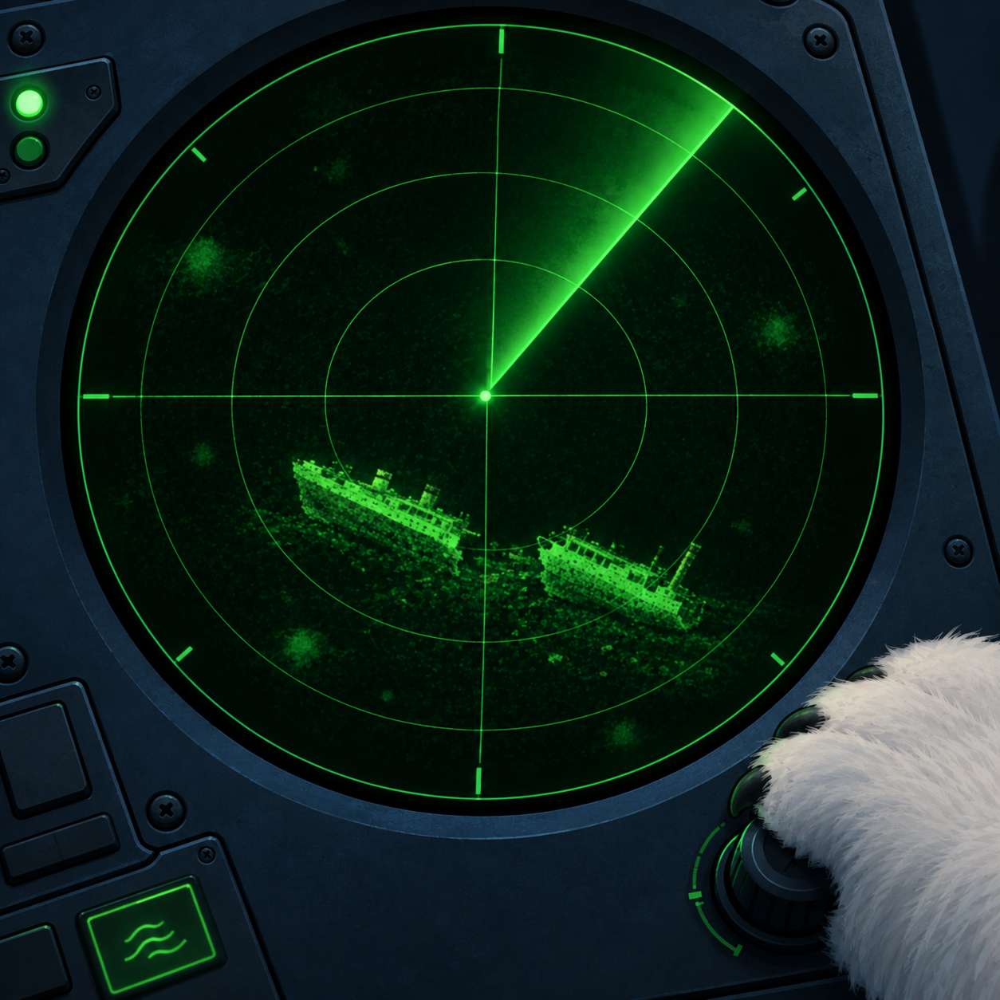

Data Cleaning
=============

A shipwreck
-----------

.. card::
   :shadow: lg

   Andromé, the navigator, and her captain Aarla are on the submarine bridge during the night watch.

   *"Captain, the sonar shows a shipwreck ahead of us!"*

   *"That must be the Titanic, a ship of the Furless. It was one of their big tragedies.
   They were quite surprised to learn that icebergs are actually dangerous.
   On top of it, most of them were not used to swimming in cold water. No wonder their civilization disappeared."*

   *"I wonder who they were. The poor people on the ship, I mean."*

   *"We should have some records in our computer. The data is a bit raggy, this could be good practice. We haven't got much work in the next two days. Why don't you grab Min Min and see whether you can clean up the data."*

---------

Load the Data
-------------

You can load the Titanic dataset with **seaborn**:

.. code:: python

   import polars as pl
   import seaborn as sns
   
   df = pl.from_pandas(sns.load_dataset("titanic"))

Inspect
-------

Inspect the columns of the DataFrame and see what data is in there. Make sure to check the following:

- check the unique values in the categorical columns
- check how frequent values are, e.g. the passenger classes
- count the null values in all columns

Replace values
--------------

Use the commands from the **Data Wrangling** chapter to replace the 'alive' column by integer values 0 and 1. Use the following expression: 

.. code:: python

   df = df.with_columns(df[...].replace({"male": 0, ...}).alias("new_name"))

Do the same for the 'sex' column. 

Integer encoding
---------------

Let's also encode a categorical column with multiple values by integers.
Compare the following two approaches.

First convert the colunmn to a categorical type:

.. code:: python

   cat = df["who"].cast(pl.Categorical)

Then create the first representation:

.. code:: python

   cat.to_physical()

and

.. code:: python

   cat.to_dummies()

Which one would you prefer and why?

Fill missing category
---------------------

Fill the missing values in the 'deck' by the constant 'unknown'.

.. code:: python

   df["deck"].fill_null(...)   

Fill by median
--------------

Fill the missing age values by the median age:

.. code:: python

   median = df["age"].median()  # ignores missing entries

   ...

Fill by grouped medians
-----------------------

If you inspect the histogram of the new age column, you should recognize a problem:

.. code:: python

   sns.histplot(df["age_filled"])

Let's try something more sophisticated: use the median age of the respective passenger class:

.. code:: python

   pclass_ages = df.group_by("pclass").agg(pl.col("age").median())

Create a replacement dictionary:

.. code:: python

   pclass_dict = pg.to_dicts()
   rep_dict = {x["pclass"]: x["age"] for x in pclass_dict}

Now roll out the median ages along the entire colunm and fill the missing values:

.. code:: python

   rep = df["pclass"].replace(rep_dict)
   df["age"].fill_null(rep)

The histogram should look nicer now.

.. hint::

   An even more sophisticated approach would be to use Machine Learning.
   Sometimes, **k-Nearest-Neighbors** is a good method for filling missing values.

Advanced challenges
-------------------

Here is a couple of things you might try if you are already familiar with plotting:

Create a bar plot indicating the number of first, second and third class passengers

- plot a histogram of the age column with 20 bins
- create a boxplot of the age column
- create a scatterplot of fare over age
- create a bar plot that shows the survived vs. dead passengers with one bar group for each gender
- create a heatmap from the correlation matrix of all columns

.. seealso::

   For many years, the `Titanic Dataset Challenge <https://www.kaggle.com/datasets/yasserh/titanic-dataset>`__ was a kind of entry challenge for machine learning.

   More recently, the data has been resampled, removing the references to natural persons. The result is known as the `Spaceship Titanic Challenge <https://www.kaggle.com/competitions/spaceship-titanic>`__
